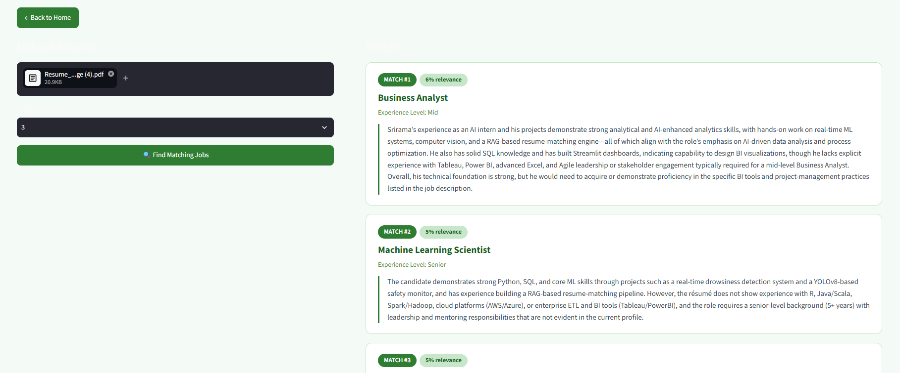
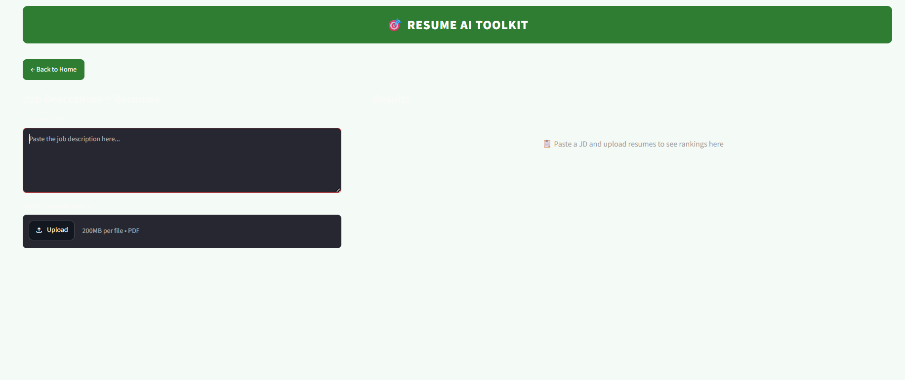
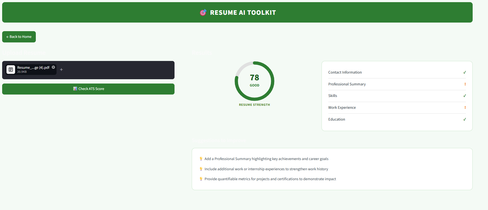
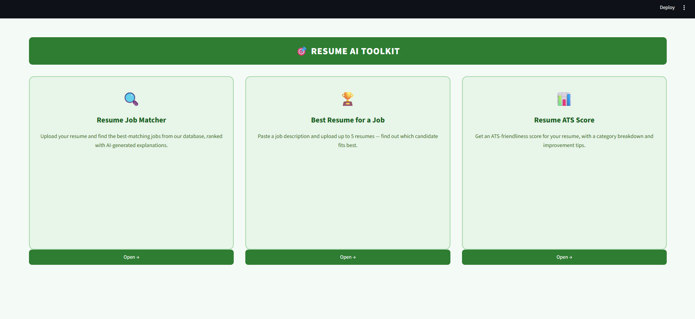

# 🎯 Resume AI Toolkit — RAG-Powered Resume & Job Matching

An AI-powered toolkit that uses **Retrieval-Augmented Generation (RAG)** to match resumes to jobs, rank multiple candidates against a job description, and evaluate resume quality — all with human-readable, grounded explanations instead of black-box scores.

## 📋 Overview

Traditional resume-job matching relies on keyword overlap, which misses candidates whose skills are described differently than the exact wording in a job posting. This project solves that by combining **semantic search** (to understand meaning, not just words) with an **LLM** (to explain *why* something matches, in plain language).

## ✨ Features

### 1. Resume → Job Matcher
Upload a resume and find the best-matching jobs from a 1,000+ job database, ranked by semantic similarity with AI-generated match explanations.



### 2. Best Resume for a Job
Paste a job description and upload up to 5 resumes — the system ranks them by fit and highlights the best match, useful for recruiter-style screening.



### 3. Resume ATS Score
Get an ATS-friendliness score for your resume with a category breakdown (contact info, summary, skills, experience, education) and specific improvement suggestions.





## 🏗️ Architecture


**Core RAG pipeline:**
1. **Retrieval** — Job postings are embedded using `Sentence-Transformers (all-MiniLM-L6-v2)` and stored in `ChromaDB`. A resume is embedded the same way, and vector similarity search retrieves the most semantically relevant jobs.
2. **Generation** — The retrieved job text and resume text are passed to an LLM (via the Groq API) with a prompt asking for a grounded explanation of the match — including strengths and gaps.

## 🛠️ Tech Stack

| Component | Technology |
|---|---|
| Embeddings | Sentence-Transformers (`all-MiniLM-L6-v2`) |
| Vector Database | ChromaDB |
| LLM | Groq API (`openai/gpt-oss-20b`) |
| PDF Extraction | pdfplumber |
| Similarity (resume ranking) | scikit-learn (cosine similarity) |
| Web UI | Streamlit |
| Data Processing | pandas |

## 📂 Project Structure

## 🚀 Running Locally

```bash
# Clone the repo
git clone https://github.com/YOUR_USERNAME/resume-job-rag.git
cd resume-job-rag

# Set up virtual environment
python -m venv venv
venv\Scripts\activate   # Windows
# source venv/bin/activate   # Mac/Linux

# Install dependencies
pip install -r requirements.txt

# Add your Groq API key
echo GROQ_API_KEY=your_key_here > .env

# Build the vector store (first time only)
python embed.py

# Run the app
streamlit run app.py
```

## 🔑 Key Design Decisions

- **Combined text embedding**: Each job's Title, Experience Level, Skills, and Responsibilities are combined into one text block before embedding, giving the model richer context than embedding skills alone.
- **Grounded generation**: The LLM is only ever asked to reason over retrieved, real content — never given the option to answer "from memory" — which prevents hallucinated explanations.
- **Separated retrieval strategies**: Job matching uses a persistent vector database (many jobs, one resume query), while resume ranking uses direct pairwise cosine similarity (few resumes, one JD) — no database needed for that smaller-scale comparison.

## 📈 Future Improvements
- Add filtering by experience level / location
- Support batch resume upload for the job matcher
- Interview question generator based on resume + matched job (planned)

---
Built by [Your Name] as a portfolio project exploring practical RAG applications.

